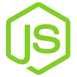
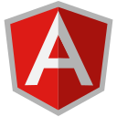

### Hi there, I'm Aaron - aka Erron Developer 👋

## I'm a Software Engineer

- 🔭 I’m currently working on my Gross Aussie API (about grocery prices)
- 🌱 I’m currently learning about the clean architecture for Flutter app
- 💻 I have a mobile app for half-price products of Woolworths, Coles, and Chemist Warehouse (available on both [Google Play][halfpricedealsandroid] and [App Store][halfpricedealsios])
- 🥅 2021 Goals: Publish Gross Aussie API and refactor the mobile app
- ⚡ Fun fact: I use Vim as my IDE most of the time, but I'm still an expert in VS Code 😁

---

### 🔨 Languages and Tools:

 
 
<!--
---

### 📚 Reading List

- [ ] [SOLID - Introduction to Software Design & Architecture - Khalil Stemmler][solidbook]
- [x] [The Murder of Roger Ackroyd - Agatha Christie][themurderofrogerackroyd]
- [x] [And Then There Were None - Agatha Christie][solidbook]
- [x] [The Shadow of the Wind - Carlos Ruiz Zafón][theshadowofthewind]
- [x] [The Devotion of Suspect X - Keigo Higashino][thedevotionofsuspectx]
-->

[halfpricedealsandroid]: https://play.google.com/store/apps/details?id=com.erron.halfpricedeals
[halfpricedealsios]: https://apps.apple.com/us/app/half-price-deals/id1518367162
[linkedin]: https://www.linkedin.com/in/aaron-nguyen-an
[solidbook]: https://solidbook.io
[theshadowofthewind]: https://www.goodreads.com/book/show/1232.The_Shadow_of_the_Wind
[thedevotionofsuspectx]: https://www.goodreads.com/book/show/8686068-the-devotion-of-suspect-x
[andthentherewerenone]: https://www.goodreads.com/book/show/16299.And_Then_There_Were_None
[themurderofrogerackroyd]: https://www.goodreads.com/book/show/16328.The_Murder_of_Roger_Ackroyd

<!--
**ntta/ntta** is a ✨ _special_ ✨ repository because its `README.md` (this file) appears on your GitHub profile.

Here are some ideas to get you started:

- 🔭 I’m currently working on ...
- 🌱 I’m currently learning ...
- 👯 I’m looking to collaborate on ...
- 🤔 I’m looking for help with ...
- 💬 Ask me about ...
- 📫 How to reach me: ...
- 😄 Pronouns: ...
- ⚡ Fun fact: ...
-->
